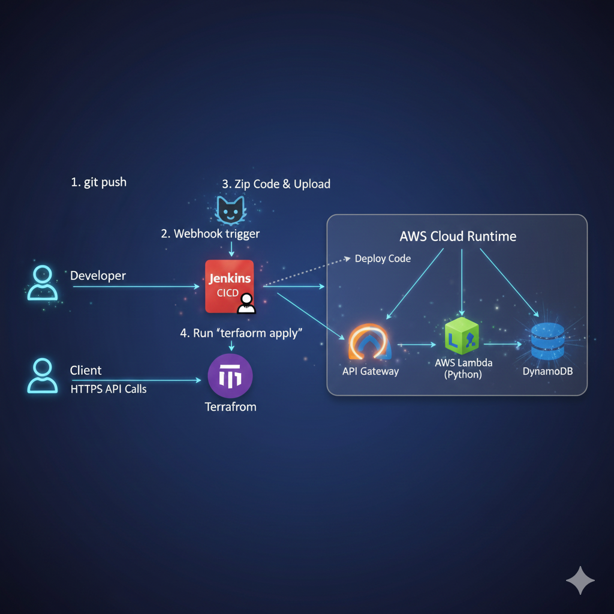
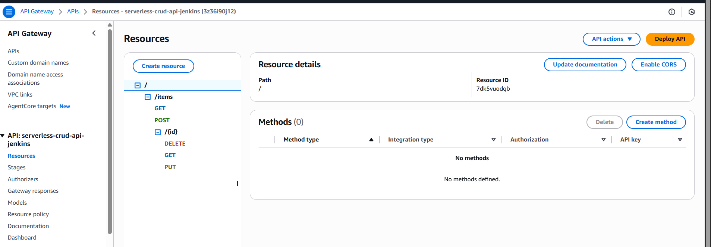
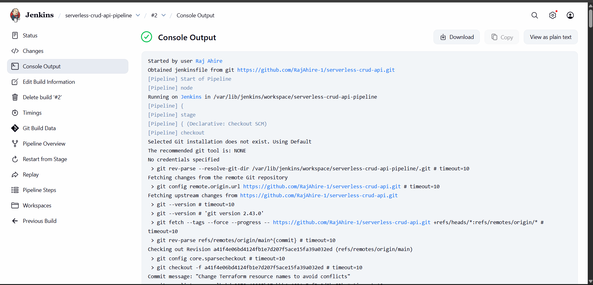
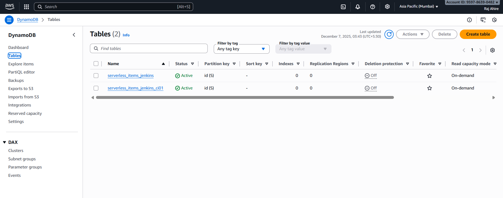
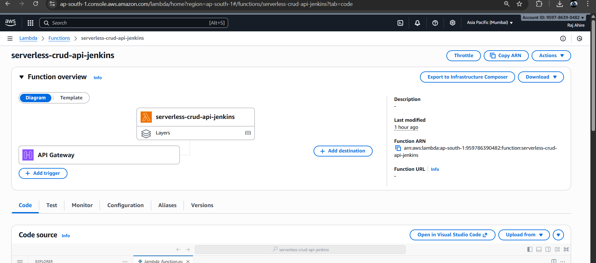
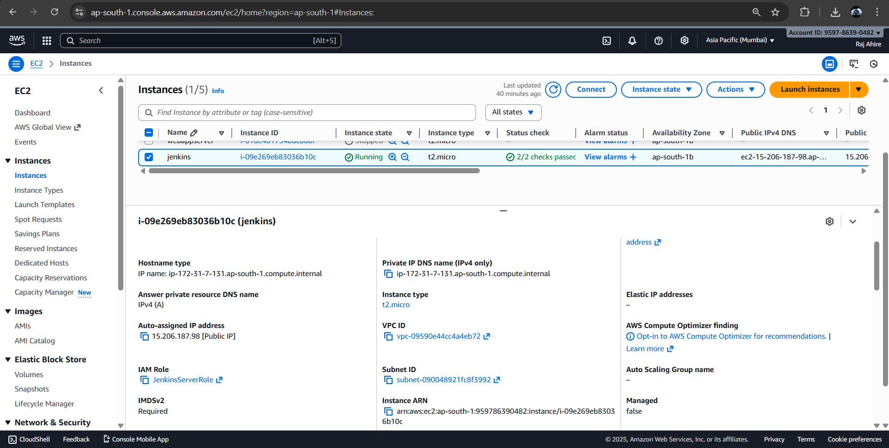
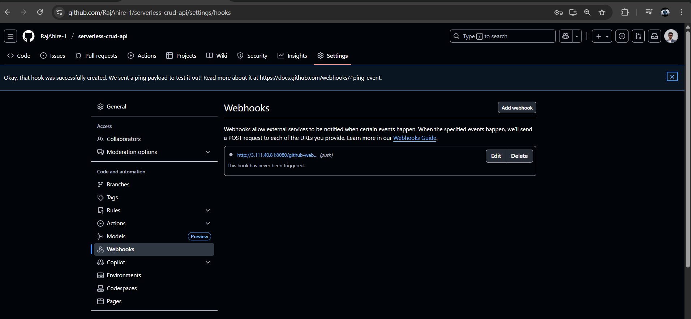

# 🚀 Serverless CRUD API using AWS Lambda, API Gateway, DynamoDB, Terraform & Jenkins CI/CD

This project demonstrates a fully automated **serverless CRUD API** deployment using:

- **AWS Lambda** (Python)
- **API Gateway REST API**
- **DynamoDB** (NoSQL table)
- **S3** for Lambda artifacts
- **Terraform** (Infrastructure as Code)
- **Jenkins CI/CD Pipeline**
- **GitHub Webhooks**

---

# 📌 Architecture Overview



```

GitHub → Jenkins → Zip Lambda → Upload to S3 → Terraform Apply → AWS Lambda → API Gateway → DynamoDB

```

This pipeline ensures **zero-downtime updates**, fully automated deployments, and clean infrastructure provisioning.

---

# 📁 Project Structure

```

serverless-crud-api/
│
├── lambda/
│   └── lambda_function.py
│
├── terraform/
│   ├── main.tf
│   ├── variables.tf
│   └── outputs.tf
│
├── Jenkinsfile
└── img/
└── (screenshots)

````

---

# 🛠️ Technologies Used

| Technology | Purpose |
|-----------|---------|
| **AWS Lambda** | CRUD logic |
| **API Gateway** | REST endpoints |
| **DynamoDB** | NoSQL database |
| **S3** | Stores Lambda zip |
| **IAM** | Lambda access policies |
| **Terraform** | IaC for all AWS resources |
| **Jenkins** | CI/CD automation |
| **GitHub Webhooks** | Auto-trigger pipeline |

---

# 🧱 Infrastructure Screenshots

## ✅ API Gateway Resources


---

## ✅ Jenkins CI/CD – Successful Pipeline


---

## ✅ DynamoDB Tables


---

## ✅ AWS Lambda Function


---

## ✅ Jenkins EC2 Server (AWS)


---

## ✅ GitHub Webhook (Auto Deployment Trigger)


---

# 🧪 API Endpoints

| Method | Endpoint | Description |
|--------|----------|-------------|
| **POST** | `/items` | Create item |
| **GET** | `/items` | List all items |
| **GET** | `/items/{id}` | Get single item |
| **PUT** | `/items/{id}` | Update item |
| **DELETE** | `/items/{id}` | Delete item |

---

# 📌 Sample CURL Commands for Testing

```bash
API="https://<api-id>.execute-api.ap-south-1.amazonaws.com/dev"

# Create Item
curl -X POST -H "Content-Type: application/json" \
  -d '{"id":"1","name":"Pen","price":10}' \
  $API/items

# Get All
curl $API/items

# Get One
curl $API/items/1

# Update
curl -X PUT -H "Content-Type: application/json" \
  -d '{"name":"Pen Updated","price":15}' \
  $API/items/1

# Delete
curl -X DELETE $API/items/1
````

---

# 🔄 CI/CD Pipeline Flow

1. Developer pushes code to GitHub
2. GitHub Webhook triggers Jenkins
3. Jenkins:

   * Downloads repo
   * Zips Lambda code
   * Uploads to S3
   * Runs `terraform apply`
4. AWS provisions/updates:

   * Lambda
   * API Gateway
   * DynamoDB
5. Jenkins validates API using curl
6. Build = **SUCCESS** 🎉

---

# 🎉 Conclusion

This project delivers a **fully automated serverless backend** with:

✔ CI/CD ready
✔ Immutable deployments
✔ Clean IaC Terraform modules
✔ Real AWS resources & screenshots
✔ Production-grade design

---

# 🙌 Author

**Raj Ahire**

---

